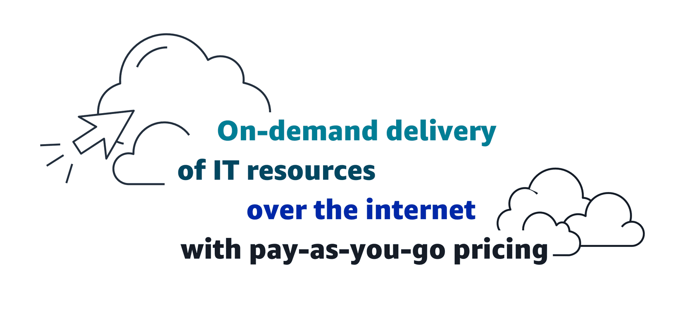
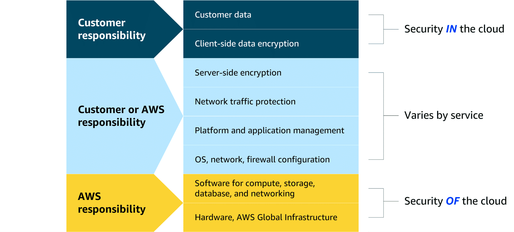

# MODULE 1: INTRODUCTION TO THE CLOUD

---

## What is Cloud Computing

- **On-demand delivery:** Can access computing resources (i.e. storage,  compute); Users can scale resource usage up or down based on current needs
- **of IT resources:** Wide array of IT assets, including servers, storage solutions, databases, networking components, AI/ML tools, and more
- **over the internet:** Delivers IT resources through internet connectivity, which means that users access and use these resources through web-based services rather than maintaining local hardware or software
- **with pay-as-you-go-pricing:** Users pay only for the resources they use, rather than committing to fixed, long-term contracts; offers cost efficiency and financial flexibility

---

## Cloud deployment types

Can deploy cloud resources in multiple ways, each type offers unique benefits and considerations

- **Cloud-based deployment**
  - Can migrate existing resources to the cloud, design and build new applications, or both
- **On-premises deployment**
  - Deploying on-premises using virtualization and resource management tools does not provide many of the benefits of the cloud
  - Sometimes sought for its ability to provide dedicated resources and low latency

- **Hybrid deployment**
  - Both deployment work together
  - Ideal for when legacy applications on premises

---

## Benefits of the AWS Cloud

- **Trade fixed expense for variable expense**
  - Can transition from fixed investments to variable costs
  - Expenses are better aligned with actual usage
  - More financial flexibility
- **Benefit from massive economies of scale**
  - Vast global infrastructure of AWS can result in lower costs for customers
  - Can be used by many organizations, from small startups to major corporations
  - Access to advanced technologies
- **Stop guessing capacity**
  - Dynamically scale resources up or down based on real-time demand
  - Can achieve optimal performance without provisioning more or less infrastructure than they need
- **Increase speed and agility**
  - Businesses can rapidly deploy applications and services
  - Accelerate time to market, facilitate quicker responses to changing business needs and market conditions
- **Stop spending money to run and maintain data centers**
  - Eliminates need to invest in physical data centers
  - Customers don’t need to spend time and money on utilities and maintenance
  - Customer resources can be reallocated to more strategic initiatives
- **Go global in minutes**
  - Businesses don’t need to set up their own infrastructure to expand globally
  - Provides robust global infrastructure
  - Customers can deploy applications and services across multiple areas

---

## Introduction to AWS Global Infrastructure

- AWS Global Infrastructure consists of physical locations around the world that contain groups of data centers
- **AWS Regions:** Physical locations around the world that contain groups of data centers
- **Availability Zones:** groups of data centers
- Each AWS Region consists of minimum 3 physically separate AZ within geographic area
- AZ consists of one or more data centers with redundant power, networking, and connectivity
- Regions and AZ are designed to provide low-latency, fault-tolerant access
- Recommended to distribute resources across multiple AZs
- If one AZ encounters outage, your applications will continue to operate without interruptions; high availability and fault tolerance

---

## AWS Shared Responsibility Model

- **Customer Responsibilities**
  - Manage security requirements for their data and who has access, includes data stored on AWS
  - Control how access is granted, managed, revoked
  - Client-side encryption
- **Shared Responsibilities**
  - Depends on service used
  - Components such as server-side encryption, network traffic protection, platform and application management, and OS, network, and firewall configuration
- **AWS Responsibilities**
  - Protect infrastructure that runs all of the services
  - Hardware, software, networking, facilities that run AWS

---

Next: [Module 2: Compute in the Cloud](https://github.com/jo2eph/aws_cloud_practitioner_notes/tree/main/02_Compute_in_the_Cloud)
