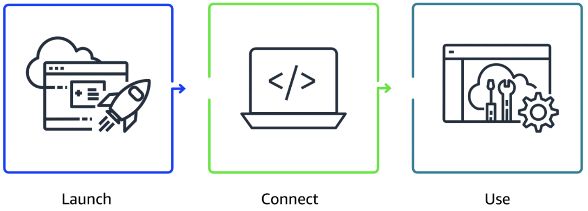
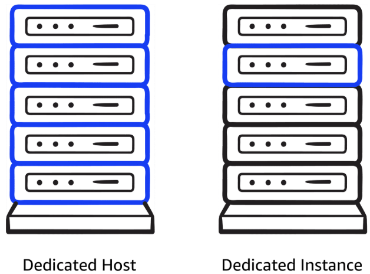

# MODULE 2: COMPUTE IN THE CLOUD

---

## Intro to Amazon Elastic Cloud Compute (EC2)

- Flexible
- Cost-effective
- Faster than managing on-premises servers
- Offers on-demand compute capacity
- Flexibility allows for faster deployment of applications
- Can launch as many or few virtual servers as needed
- Configure security, networking, and storage
- Can scale resources up or down based on usage
- **Multi-tenancy:** Each virtual machine is isolated but shares resources from host machine

### Key takeaways: Comparing on-premises and cloud resources

- Challenges of on-premise resources
  - Spend money upfront to purchase hardware
  - Wait for servers to be delivered
  - Install servers in your physical data center
  - Make all necessary configuration
  - Time consuming, costly, and inflexible
- Benefits of using Cloud Resources
  - Pay only for compute time used when instance is running
  - Provision and launch EC2 instance within minutes
  - Stop using instances after workload has completed
  - Scale up or down based on demand

---

## How EC2 Works

- **STEP 1: Launch an instance**
  - Start by selecting Amazon Machine Image (AMI), which defines the operating system and might include additional software
  - Can also choose instance type, which determines underlying hardware resources (CPU, memory, network performance)

- **STEP 2: Connect to the instance**
  - Can connect to instance in various ways
  - Can connect using SSH for Linux instances or Remote Desktop Protocol (RDP) for Windows instances
  - Alternatively, AWS services like AWS Systems Manager offer secure and simplified method for accessing instances

- **STEP 3: Use the instance**
  - After you connect, you can use to run commands, install software, add storage, organize files, and perform other tasks

---

## Amazon EC2 Instance Types

Each EC2 Instance type is grouped under Instance family:

- **General purpose**
  - Balanced mix of compute, memory, networking resources
  - Balanced resources
  - Ideal for diverse workloads
    - e.g. Web servers, Code repositories
  - Good starting point if you don’t know how your workload will perform

- **Compute optimized**
  - Compute-intensive tasks
  - Gaming servers
  - High performance computing (HPC)
  - Scientific modeling
  - Machine learning

- **Memory optimized**
  - Memory-intense tasks
  - Processing large datasets, data analytics, databases
  - Provide fast performance for memory-heavy workloads

- **Accelerated computing**
  - Floating point number calculations
  - Graphics processing
  - Data pattern matching
  - Hardware accelerators (e.g. GPUs)

- **Storage optimized**
  - High performance for locally stored data
  - Large databases
  - Data warehousing
  - I/O-intensive applications

Extra reading: [Amazon EC2 instance type naming conventions](https://docs.aws.amazon.com/ec2/latest/instancetypes/instance-type-names.html)

---

## How to Provision AWS Resources

All interactions are powered by APIs.

Can access these APIs through 3 primary methods:

- **AWS Management Console**
  - Web interface for managing AWS services
  - Offers quick access to services, search functionality, and simplified workflows
  - With mobile app, monitor resources, view alarms, check billing
  - Good for: users who prefer a visual, easy-to-use interface for managing and configuring AWS services

- **AWS CLI**
  - Manage multiple AWS services from command line across Windows, MacOS, Linux
  - Automate tasks through scripts (i.e. launching EC2 instances)
  - Good for: advanced users and developers who need to automate tasks, script action, and manage AWS resources efficiently from CLI

- **AWS SDK**
  - Simplifies integrating AWS services into your applications by providing APIs for various programming languages
  - AWS offers documentation for languages like C++, Java, .NET
  - Good for: developers looking to integrate AWS services into their applications using language-specific APIs

---

## Amazon EC2 Pricing

- **On-Demand Instances**
  - Pay only for the compute capacity you consume
  - No upfront payments or long-term commitments needed

- **Saving Plans**
  - Save up to 72% across variety of instance types and services by committing to consistent usage level for 1 to 3 years

- **Reserved Instances**
  - Get savings of up to 75% by committing to a 1-year or 3-year term for predictable workloads using specific instance families and AWS Regions

- **Dedicated Hosts**
  - Reserve an entire physical server for your exclusive use
  - Offers full control
  - Ideal for workloads with strict security or licensing needs

- **Spot Instances**
  - Bid on spare compute capacity at up to 90% off the On-Demand price, with the flexibility to be interrupted when AWS reclaims the instance

- **Dedicated Instances**
  - Pay for instances running on hardware dedicated solely to your account
  - Provides isolation from other AWS customers

### Dedicated Instances

- **Dedicated Hosts**
  - Provides exclusive use of physical servers
  - Offer full control over instance placement and resource allocation
  - Ideal for security- or compliance-driven workloads

- **Dedicated Instances**
  - Offer physical isolation from other AWS accounts
  - Still benefit from flexibility and cost savings of shared infrastructure

- Key difference:
  - Dedicated Instances provide isolation without you choosing which physical server they run on
  - Dedicated Hosts gives you entire physical server for exclusive use
- Right choice depends on your specific workload requirements and level of control you need over your infrastructure

### More about cost optimization

- Savings Plans
  - Good for: Predictable workloads
  - Offer discounts compared to On-Demand rates in exchange for commitment to use specified amount of compute power (measured per hour) over a 1-year or 3-year period
  - Flexible pricing for EC2, AWS Fargate, AWS Lambda, Amazon Sagemaker AI usage, regardless of instance type or Region
  - Payment options include All upfront, Partial upfront, or No upfront
- Capacity Reservations
  - Good for: Critical workloads with strict capacity requirements
  - Reserve compute capacity in a specific AZ
  - Charged at On-Demand rate, whether used or not
  - Only pay for instances you run
  - Ideal for strict capacity requirements for current or future business-critical workloads
- Reserved Instances flexibility
  - Good for: Steady-state workloads with predictable usage
  - Offers up to 75% savings over On-Demand pricing by applying discounts across instance types and multiple AZs within a Region
  - When you purchase RI, AWS automatically applies discount to other instance sizes within same family based on instance size footprint
  - Also applies discount across multiple AZ for enhanced resource distribution and fault tolerance

---

## Scaling Amazon EC2

### Scalability

- Ability of a system to handle an increased load by adding resources
- Scale by adding more power to existing machines, or scale out by adding more machines
- Scalability focuses on long-term capacity planning to make sure system can grow and accommodate more users or workloads as needed

### Elasticity

- Ability to automatically scale resources up or down in response to real-time demand
- Rapidly scale out during periods of high-demands, scale in during low-demands
- Provides cost-efficiency, optimal resource usage

### Amazon #C2 Auto Scaling

- Amazon EC2 Auto Scaling automatically adjusts number of EC2 instances based on changes in application demand
- Offers two approaches:
  - **Dynamic Scaling** adjusts in real time to fluctuations in demand
  - **Predictive Scaling** preemptively schedules the right number of instances based on anticipated demand

You can create **Auto Scaling groups**: collections of EC2 instances that can scale in or out to meet application’s needs

Auto Scaling group is configured with three key settings:

- Minimum Capacity
  - Least number of EC2 instances required to keep application running
  - Ensures system nevers scale below this threshold
- Desired Capacity
  - Ideal number of instances needed to handle current workload, which Auto Scaling aims to maintain
  - If desired capacity is not specified, it defaults to minimum capacity
- Maximum Capacity
  - Upper limit on number of instances that can be launched
  - Prevents over-scaling and controlling costs

---

## Directing Traffic with Elastic Load Balancing

---

## Messaging and Queuing

---

Previous: [Module 1: Introduction to the Cloud](https://github.com/jo2eph/aws_cloud_practitioner_notes/tree/main/01_Introduction_to_the_Cloud)

Next: [Module 3: Exploring Compute Services](https://github.com/jo2eph/aws_cloud_practitioner_notes/tree/main/03_Exploring_Compute_Services)
