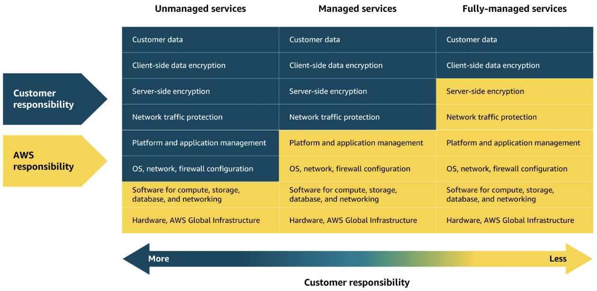

# MODULE 3: EXPLORING COMPUTE SERVICES

---

## Introduction to Serverless Computing

### Unmanaged and managed services

- **Unmanaged services**
  - e.g. EC2
  - AWS only takes care of underlying physical infrastructure
  - You are responsible for setting up, securing, maintaining operating system, network configurations, applications
- **Managed services**
  - Handles most of infrastructure you need to manage
  - You might still need to perform some provisioning or configuration, like deployment options, scaling, environment settings

### Fully-managed services

- e.g. serverless services, Lambda (serverless compute service)
- Eliminates need for provision or manage any servers
- Underlying infrastructure fully managed by AWS
- Users can focus on writing and deploying code

---

## AWS Lambda

### Lambda

- **Lambda:** Serverless compute service that runs code in response to events without the need to provision or manage servers
- Automatically manages underlying infrastructure, scaling resources up and down based on volume of requests
- You are only charged for compute time consumed
- Lambda handles execution, scaling, resource allocation
- Can optimize performance by configuring appropriate memory size for your function

### How Lambda works

1. Upload code to Lambda
    - Upload code to Lambda, which uploads as Lambda function

2. Set code to trigger from an event source
    - Configure code to be triggered by events (e.g. AWS services, mobile apps, HTTP requests)

3. Run code when triggered
    - Code runs only when event occurs (e.g. file upload, user actions)
    - Lambda automatically handles server management, scaling, infrastructure
    - Lambda runtime executes your function code using the event data passed to it
    - Ensures code runs reliably, securely, and efficiently

4. Pay only for the compute time
    - You are charged only for compute time consumed down to the millisecond
    - Price depends on amount of memory allocated to function

### Lambda use cases

- Real-time image processing for a social media application
  - A social media company uses Lambda to process images uploaded by users
  - When photo is uploaded, Lambda is triggered to resize image, apply filters, and save it in optimized format to storage
  - Ensures application can handle high volume of uploads without needing to manage infrastructure
  - Why Lambda:  Automatically scales based on uploads and charges only for the time spent processing each image
- Personalized content delivery for a news aggregator
  - A news aggregator uses Lambda to fetch and process news articles from multiple sources, then it tailors recommendations based on user preferences
  - When user opens application or performs search, Lambda functions are triggered to retrieve data, run personalization logic, and return relevant content
  - Why Lambda:  Automatically scales with user traffic and reduce costs by running code only when users interact
- Real-time event handling for an online game
  - A gaming company uses Lambda to handle in-game events (e.g. player actions, game state changes, real-time leaderboard updates)
  - Each event (e.g. scoring point or unlocking achievement) triggers Lambda function that updates player data and game status
  - Why Lambda:  Handles thousands of events, in real-time, with no need to manage servers. Cost scales with usage, which is ideal for peak gaming times.

---

## Containers and Orchestration on AWS

---

## Additional Compute Services

---

Previous: [Module 2: Compute in the Cloud](https://github.com/jo2eph/aws_cloud_practitioner_notes/tree/main/02_Compute_in_the_Cloud)

Next: [Module 4: Going Global](https://github.com/jo2eph/aws_cloud_practitioner_notes/tree/main/04_Going_Global)
