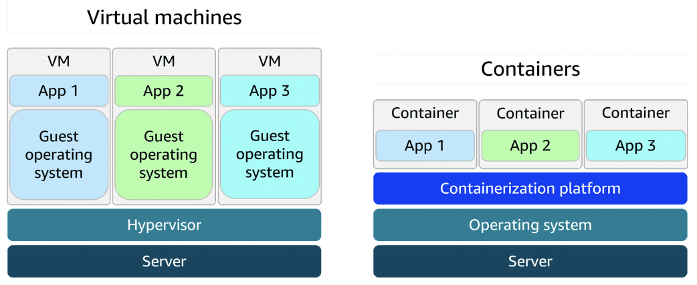

# MODULE 3: EXPLORING COMPUTE SERVICES

---

## Introduction to Serverless Computing

### Unmanaged and managed services

- **Unmanaged services**
  - e.g. EC2
  - AWS only takes care of underlying physical infrastructure
  - You are responsible for setting up, securing, maintaining operating system, network configurations, applications
- **Managed services**
  - Handles most of infrastructure you need to manage
  - You might still need to perform some provisioning or configuration, like deployment options, scaling, environment settings

### Fully-managed services

- e.g. serverless services, Lambda (serverless compute service)
- Eliminates need for provision or manage any servers
- Underlying infrastructure fully managed by AWS
- Users can focus on writing and deploying code

---

## AWS Lambda

### Lambda

- **Lambda:** Serverless compute service that runs code in response to events without the need to provision or manage servers
- Automatically manages underlying infrastructure, scaling resources up and down based on volume of requests
- You are only charged for compute time consumed
- Lambda handles execution, scaling, resource allocation
- Can optimize performance by configuring appropriate memory size for your function

### How Lambda works

1. Upload code to Lambda
    - Upload code to Lambda, which uploads as Lambda function

2. Set code to trigger from an event source
    - Configure code to be triggered by events (e.g. AWS services, mobile apps, HTTP requests)

3. Run code when triggered
    - Code runs only when event occurs (e.g. file upload, user actions)
    - Lambda automatically handles server management, scaling, infrastructure
    - Lambda runtime executes your function code using the event data passed to it
    - Ensures code runs reliably, securely, and efficiently

4. Pay only for the compute time
    - You are charged only for compute time consumed down to the millisecond
    - Price depends on amount of memory allocated to function

### Lambda use cases

- Real-time image processing for a social media application
  - A social media company uses Lambda to process images uploaded by users
  - When photo is uploaded, Lambda is triggered to resize image, apply filters, and save it in optimized format to storage
  - Ensures application can handle high volume of uploads without needing to manage infrastructure
  - Why Lambda:  Automatically scales based on uploads and charges only for the time spent processing each image
- Personalized content delivery for a news aggregator
  - A news aggregator uses Lambda to fetch and process news articles from multiple sources, then it tailors recommendations based on user preferences
  - When user opens application or performs search, Lambda functions are triggered to retrieve data, run personalization logic, and return relevant content
  - Why Lambda:  Automatically scales with user traffic and reduce costs by running code only when users interact
- Real-time event handling for an online game
  - A gaming company uses Lambda to handle in-game events (e.g. player actions, game state changes, real-time leaderboard updates)
  - Each event (e.g. scoring point or unlocking achievement) triggers Lambda function that updates player data and game status
  - Why Lambda:  Handles thousands of events, in real-time, with no need to manage servers. Cost scales with usage, which is ideal for peak gaming times.

---

## Containers and Orchestration on AWS

### Containers and VMs

- **Container** packages your application with everything it needs to run, so it works the same on any computer
- Containers are faster and lighter than Virtual Machines (VMs) since they share the host computer’s OS
- VMs use hypervisor to run full, separate OS, making them less resource-efficient and have longer startup times

### Deployment consistency with containers

- When developer’s environment differs from staging or production, deployments can fail and become difficult to debug
- Containers keep application’s environment consistent everywhere
- Makes deployments smoother and assist troubleshooting

- As containerized applications scale, managing them becomes complex
- Setup starting with a few containers on a single host can quickly grow into hundreds of containers across multiple hosts
- Manually handling container lifecycle, monitoring, and general operations becomes unsustainable
- **Orchestration** tools automate deployment, scaling, and management to keep everything running smoothly

### AWS container services

AWS has set of tools for managing containers that fits into three categories:

- Orchestration
- Registry
- Compute

#### Amazon ECS

- **Amazon Elastic Container Service (ECS):** Scalable container orchestration service for running and managing containers on AWS (e.g. Docker containers)

- Amazon ECS launch types:
  - **Amazon ECS with Amazon EC2**
    - Ideal for small-to-medium businesses that need full control over infrastructure
    - Suitable for custom applications requiring specific hardware or networking configurations, with flexibility of EC2 and simplicity of ECS
  - **Amazon ECS with AWS Fargate**
    - Ideal for startups or small teams building web applications with variable traffic
    - Serverless option, no management required

#### Amazon EKS

- **Amazon Elastic Kubernetes Service (EKS):** Fully managed service for running Kubernetes on AWS
- Simplifies deploying, managing, and scaling containerized applications using open-sourced Kubernetes

- Amazon EKS launch types:
  - **Amazon EKS with Amazon EC2**
    - Ideal for enterprises needing full control over infrastructure
    - Offers deep customization of EC2 instances alongside Kubernetes scalability
    - Ideal for complex, large-scale workloads
  - **Amazon EKS with AWS Fargate**
    - Great for teams wanting Kubernetes flexibility without managing servers
    - Combines Kubernetes power with serverless simplicity

#### Amazon ECR

- **Amazon Elastic Container Registry (ECR):** Store, manage, and deploy container images
- Supports container images that follow the Open Container Initiative (OCI) standards
- Can push, pull, and manage images in your ECR repositories using standard container tooling and CLIs

#### Fargate

- **AWS Fargate:** Serverless compute engine for containers
- Works with both ECS and EKS
- Container hosting platform (ECS and EKS are both orchestration services)
- You do not need to provision or manage servers
- Fargate manages server infrastructure for you
- Pay only for the resources that are required to run your containers

---

## Additional Compute Services

AWS offers purpose-built services for specific needs (i.e.g streamlining web application deployment, managing batch workloads, providing virtual servers, extending cloud infrastructure to on-premises data centers)

### Elastic Beanstalk

- **Elastic Beanstalk:** Fully managed service that streamlines deployment, management, and scaling of web applications
- Simplified provisioning, scaling, load balancing, and application health monitoring
- Supports various programming languages and frameworks (i.e. Java, .NET, Python, Node.js, Docker)
- Provides full control over underlying AWS resources while automating many operational tasks
- Good for:
  - Deploying and managing web applications, RESTful APIs, mobile backend services, and microservices architectures, with automated scaling and simplified infrastructure management

### AWS Batch

- **AWS Batch:** Fully managed service used to run batch computing workloads on AWS
- Automatically schedules, manages, and scales compute resources for batch jobs
- Parallel processing support
- Optimizes resource allocation based on job requirements
- Good for:
  - Processing large-scale, parallel workloads in areas like scientific computing, financial risk analysis, media transcoding, big data processing, machine learning training, genomics research

### Lightsail

- **Lightsail:** Cloud service that offers virtual private servers (VSPs), storage, databases, and networking at a predictable monthly price
- Ideal for small businesses, basic workloads, and developers seeking a straightforward AWS experience
- Good for:
  - Basic web applications
  - Low-traffic websites
  - Development and testing environments
  - Small business websites
  - Blogs
  - Learning cloud services

### Outposts

- **AWS Outposts:** Fully managed hybrid cloud solution that extends AWS infrastructure and services to on-premises data centers
- Provides consistent experience between on-premises and AWS Cloud, offering compute, storage, and networking components
- Good for:
  - Low-latency applications
  - Data processing in remote locations
  - Migrating and modernizing legacy applications
  - Meeting regulatory compliance or data residency requirements

---

Previous: [Module 2: Compute in the Cloud](https://github.com/jo2eph/aws_cloud_practitioner_notes/tree/main/02_Compute_in_the_Cloud)

Next: [Module 4: Going Global](https://github.com/jo2eph/aws_cloud_practitioner_notes/tree/main/04_Going_Global)
