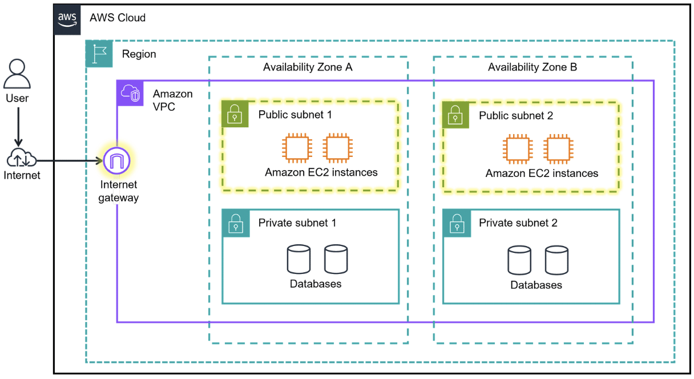

# MODULE 5: NETWORKING

---

## Introduction to Networking

- **Amazon Virtual Private Cloud (VPC)**
  - Logically isolated section of AWS Cloud
  - Launch AWS resources in a virtual network that you define
- **Subnet**
  - Organize resources
  - Can be publicly or privately accessible
  - Private subnets commonly used to contain resources like a database storing customer or transactional info
  - Public subnets commonly used for resources like a customer-facing website

---

## Organizing AWS Cloud Resources

### Amazon VPC

- Provision isolated section of AWS Cloud
- Within isolated section, you can launch resources in a virtual network you define
- Benefits:
- Increase security
- Save time
- Control environment

### Subnets

- Within Amazon VPC, you can organize resources into subnets
- Subnet: section of Amazon VPC that can contain resources (e.g. EC2)

### Connecting your resources with an internet gateway

- To allow public traffic from internet to access your VPC, attach internet gateway
- Internet gateway: connection between VPC and internet
- Without internet gateway, no one can access the resources within your VPC

### Virtual private gateways

- **Virtual private network (VPN)**
  - Creates connection that hides and protects everything you send and receive via encryption
  - VPN is a way to protect traffic you send on the internet from the public, internet service providers, and others who might try to intercept it
- **Virtual private gateway**
  - Component in AWS Cloud that makes it possible to connect protected traffic to enter the VPC
  - Establish VPN connection between your VPC and a private network (e.g. on-premises data centers, internal corporate network)
  - Allows traffic into VPC only if coming from an approved network

---

## More Ways to Connect to the AWS Cloud

---

## Subnets, Security Groups, and Network Access Control Lists

---

## Global Networking

---

## Global Architectures

---

Previous: [Module 4: Going Global](https://github.com/jo2eph/aws_cloud_practitioner_notes/tree/main/04_Going_Global)

Next: [Module 6: Storage](https://github.com/jo2eph/aws_cloud_practitioner_notes/tree/main/06_Storage)
